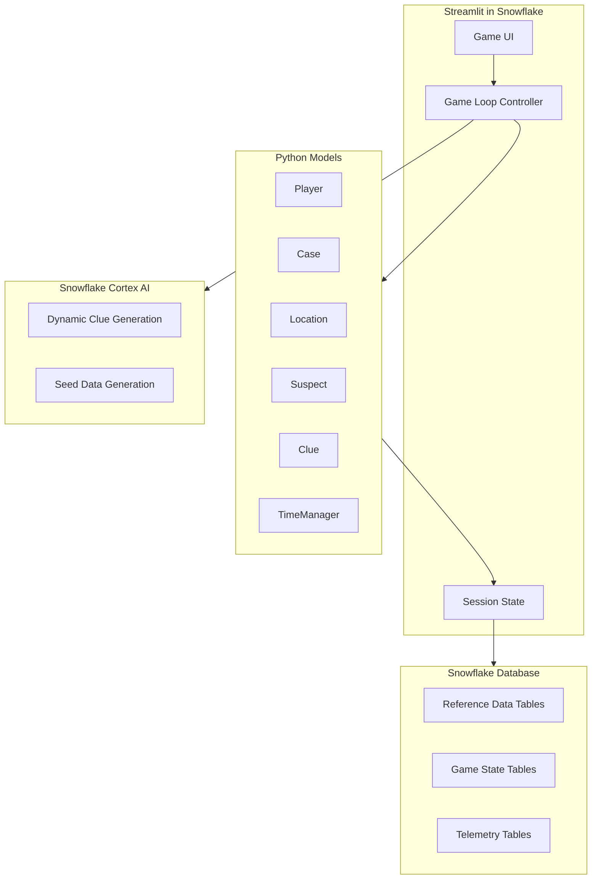
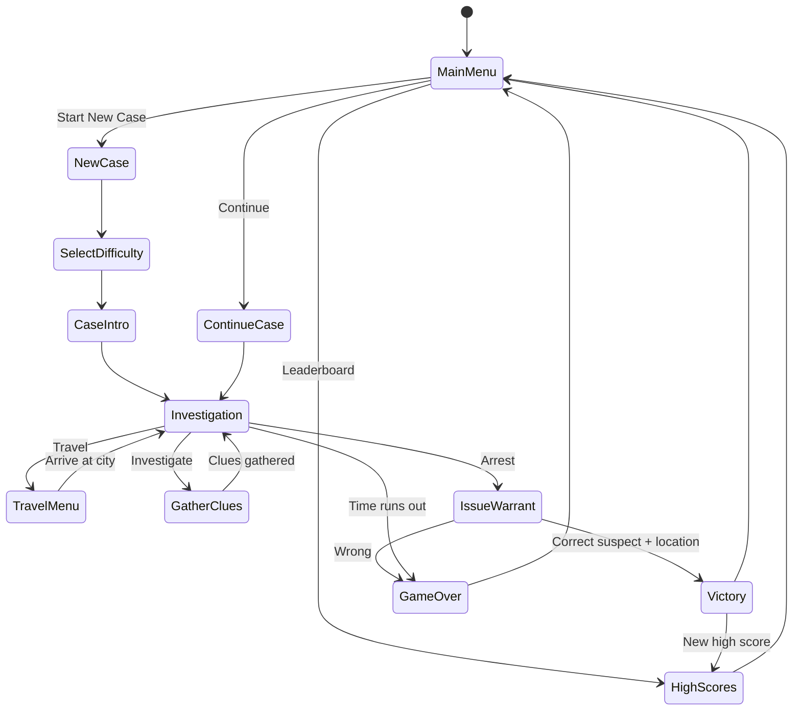

# Where in the World is Snowflake Boseman Montana?

A Carmen Sandiego-style geography chase game built as a Streamlit in Snowflake application.

## Architecture Overview



---

## Database Schema (Snowflake Hybrid Tables)

All tables use Hybrid Tables for fast transactional access with primary key lookups.

### Reference Data Tables

```sql
CREATE OR REPLACE HYBRID TABLE locations (
    location_id VARCHAR PRIMARY KEY,
    city VARCHAR NOT NULL,
    country VARCHAR NOT NULL,
    continent VARCHAR NOT NULL,
    latitude FLOAT,
    longitude FLOAT,
    description VARCHAR,
    image_url VARCHAR  -- Location scene art (300x400px)
);

CREATE OR REPLACE HYBRID TABLE landmarks (
    landmark_id VARCHAR PRIMARY KEY,
    location_id VARCHAR NOT NULL,
    name VARCHAR NOT NULL,
    landmark_type VARCHAR,
    clue_facts ARRAY,
    image_url VARCHAR,  -- Landmark art (200x150px)
    FOREIGN KEY (location_id) REFERENCES locations(location_id)
);

CREATE OR REPLACE HYBRID TABLE suspects (
    suspect_id VARCHAR PRIMARY KEY,
    name VARCHAR NOT NULL,
    hair_color VARCHAR,
    eye_color VARCHAR,
    hobby VARCHAR,
    vehicle VARCHAR,
    favorite_food VARCHAR,
    distinguishing_feature VARCHAR,
    mugshot_url VARCHAR  -- Suspect portrait art (150x200px)
);

CREATE OR REPLACE HYBRID TABLE clue_images (
    image_id VARCHAR PRIMARY KEY,
    clue_type VARCHAR NOT NULL,  -- 'destination', 'suspect', 'item'
    image_url VARCHAR NOT NULL,  -- Clue art (100x100px)
    description VARCHAR
);
```

### Game State Tables

```sql
CREATE OR REPLACE HYBRID TABLE players (
    player_id VARCHAR PRIMARY KEY,  -- Uses CURRENT_USER() from Snowflake session
    snowflake_user VARCHAR NOT NULL,
    email VARCHAR,
    rank VARCHAR DEFAULT 'Rookie',
    cases_solved INT DEFAULT 0,
    total_score INT DEFAULT 0,
    created_at TIMESTAMP DEFAULT CURRENT_TIMESTAMP()
);

CREATE OR REPLACE HYBRID TABLE cases (
    case_id VARCHAR PRIMARY KEY,
    player_id VARCHAR NOT NULL,
    suspect_id VARCHAR NOT NULL,
    stolen_item VARCHAR NOT NULL,
    difficulty INT NOT NULL,
    location_path ARRAY,
    status VARCHAR DEFAULT 'active',
    started_at TIMESTAMP DEFAULT CURRENT_TIMESTAMP(),
    FOREIGN KEY (player_id) REFERENCES players(player_id),
    FOREIGN KEY (suspect_id) REFERENCES suspects(suspect_id)
);

CREATE OR REPLACE HYBRID TABLE case_progress (
    case_id VARCHAR PRIMARY KEY,
    current_location_id VARCHAR NOT NULL,
    suspect_location_idx INT DEFAULT 0,
    hours_remaining INT NOT NULL,
    clues_gathered ARRAY,
    locations_visited ARRAY,
    updated_at TIMESTAMP DEFAULT CURRENT_TIMESTAMP(),
    FOREIGN KEY (case_id) REFERENCES cases(case_id),
    FOREIGN KEY (current_location_id) REFERENCES locations(location_id)
);

CREATE OR REPLACE HYBRID TABLE high_scores (
    score_id VARCHAR PRIMARY KEY,
    player_id VARCHAR NOT NULL,
    case_id VARCHAR NOT NULL,
    difficulty INT NOT NULL,
    completion_time_hours INT NOT NULL,
    locations_visited INT NOT NULL,
    score INT NOT NULL,
    achieved_at TIMESTAMP DEFAULT CURRENT_TIMESTAMP(),
    FOREIGN KEY (player_id) REFERENCES players(player_id),
    FOREIGN KEY (case_id) REFERENCES cases(case_id),
    INDEX idx_high_scores_difficulty (difficulty),
    INDEX idx_high_scores_score (score DESC)
);
```

### Telemetry Tables

```sql
CREATE OR REPLACE HYBRID TABLE game_sessions (
    session_id VARCHAR PRIMARY KEY,
    player_id VARCHAR NOT NULL,
    started_at TIMESTAMP DEFAULT CURRENT_TIMESTAMP(),
    ended_at TIMESTAMP,
    duration_seconds INT,
    cases_started INT DEFAULT 0,
    cases_completed INT DEFAULT 0,
    FOREIGN KEY (player_id) REFERENCES players(player_id)
);

CREATE OR REPLACE HYBRID TABLE game_events (
    event_id VARCHAR PRIMARY KEY,
    session_id VARCHAR NOT NULL,
    player_id VARCHAR NOT NULL,
    case_id VARCHAR,
    event_type VARCHAR NOT NULL,
    event_data VARIANT,
    created_at TIMESTAMP DEFAULT CURRENT_TIMESTAMP(),
    FOREIGN KEY (session_id) REFERENCES game_sessions(session_id),
    INDEX idx_events_player (player_id),
    INDEX idx_events_type (event_type),
    INDEX idx_events_time (created_at)
);

CREATE OR REPLACE HYBRID TABLE case_analytics (
    case_id VARCHAR PRIMARY KEY,
    player_id VARCHAR NOT NULL,
    difficulty INT NOT NULL,
    outcome VARCHAR NOT NULL,  -- 'won', 'lost_time', 'lost_wrong_arrest', 'abandoned'
    total_locations_in_path INT,
    locations_visited INT,
    correct_travels INT,
    wrong_travels INT,
    clues_gathered INT,
    time_budget_hours INT,
    time_used_hours INT,
    started_at TIMESTAMP,
    ended_at TIMESTAMP,
    FOREIGN KEY (player_id) REFERENCES players(player_id),
    INDEX idx_analytics_difficulty (difficulty),
    INDEX idx_analytics_outcome (outcome)
);

CREATE OR REPLACE HYBRID TABLE friction_points (
    friction_id VARCHAR PRIMARY KEY,
    player_id VARCHAR NOT NULL,
    case_id VARCHAR NOT NULL,
    location_id VARCHAR NOT NULL,
    friction_type VARCHAR NOT NULL,
    attempts_at_location INT,
    time_spent_hours INT,
    created_at TIMESTAMP DEFAULT CURRENT_TIMESTAMP(),
    FOREIGN KEY (location_id) REFERENCES locations(location_id),
    INDEX idx_friction_location (location_id),
    INDEX idx_friction_type (friction_type)
);
```

### Event Types

| Event Type | Description | Event Data |
|------------|-------------|------------|
| `session_start` | Player opened the app | `{}` |
| `session_end` | Player closed/left | `{duration_seconds}` |
| `case_start` | Started new case | `{difficulty, suspect_id}` |
| `case_win` | Successfully arrested suspect | `{time_remaining, locations_visited}` |
| `case_lose` | Failed case | `{reason: 'time'\|'wrong_arrest'}` |
| `case_abandon` | Left case incomplete | `{locations_visited, time_remaining}` |
| `travel` | Traveled to new city | `{from_location, to_location, was_correct}` |
| `investigate` | Gathered clues | `{location_id, clues_received}` |
| `arrest_attempt` | Tried to arrest | `{suspect_guess, was_correct}` |

---

## Difficulty Levels

| Level | Time Budget | Clue Clarity | Locations | Red Herrings |
|-------|-------------|--------------|-----------|--------------|
| SELECT * FROM clues | 72 hrs | Very obvious | 3-4 | 0 |
| WITH (NOLOCK) | 48 hrs | Clear | 4-5 | 1 |
| Foreign Key Violation | 36 hrs | Cryptic | 5-7 | 2 |
| Deadlock Victim | 24 hrs | Very cryptic | 6-8 | 3 |
| Little Bobby Tables | 12 hrs | Riddles only | 8-10 | 4 |

---

## Player Identity (Auto-detected)

```python
def get_or_create_player(session) -> Player:
    """Get current player from Snowflake session context - no login needed"""
    user_info = session.sql("""
        SELECT 
            CURRENT_USER() as username,
            CURRENT_ROLE() as role,
            CURRENT_ACCOUNT() as account
    """).collect()[0]
    
    player_id = user_info['USERNAME']
    
    # Upsert player record on first visit
    session.sql(f"""
        MERGE INTO players p
        USING (SELECT '{player_id}' as player_id) src
        ON p.player_id = src.player_id
        WHEN NOT MATCHED THEN
            INSERT (player_id, snowflake_user)
            VALUES ('{player_id}', '{player_id}')
    """).collect()
    
    return load_player(session, player_id)
```

---

## Snowflake Cortex AI Integration

### Content Safety System Prompt

```python
SAFETY_SYSTEM_PROMPT = """
You are a content generator for a family-friendly geography education game 
similar to "Where in the World is Carmen Sandiego?" 

CONTENT GUIDELINES:
- All content must be safe for work and appropriate for all ages
- Focus on geography, culture, landmarks, history, and travel
- No violence, adult themes, controversial politics, or sensitive topics
- Keep descriptions educational, fun, and engaging
- Use playful detective/mystery language appropriate for the game theme
- Avoid stereotypes; represent cultures respectfully and accurately
"""
```

### Safe Cortex Wrapper

```python
def safe_complete(session, prompt: str, model: str = "llama3.1-8b") -> str:
    """Wrapper ensuring safe content generation with Cortex Guard"""
    full_prompt = f"{SAFETY_SYSTEM_PROMPT}\n\n{prompt}"
    result = session.sql(f"""
        SELECT SNOWFLAKE.CORTEX.COMPLETE(
            '{model}',
            $${full_prompt}$$,
            {{'guard': TRUE}}
        ) as response
    """).collect()[0]['RESPONSE']
    return result
```

### Seed Data Generation

```sql
-- Generate location descriptions
UPDATE locations SET description = SNOWFLAKE.CORTEX.COMPLETE(
    'llama3.1-8b',
    CONCAT('Write a 2-sentence travel guide description for ', city, ', ', country, 
           '. Focus on what makes it unique for tourists.'),
    {'guard': TRUE}
);

-- Generate landmark facts for clues
UPDATE landmarks SET clue_facts = PARSE_JSON(SNOWFLAKE.CORTEX.COMPLETE(
    'llama3.1-8b',
    CONCAT('Generate 5 interesting facts about ', name, ' in JSON array format. ',
           'Facts should be useful as geography game clues.'),
    {'guard': TRUE}
));
```

### Dynamic Clue Generation

```python
def generate_destination_clue(session, next_location: Location, difficulty: int) -> str:
    """Generate a clue hinting at the next destination"""
    clarity = {1: "very obvious", 2: "clear", 3: "somewhat cryptic", 
               4: "cryptic riddle", 5: "extremely cryptic puzzle"}
    
    prompt = f"""
    Generate a {clarity[difficulty]} clue that hints the suspect is heading to 
    {next_location.city}, {next_location.country}.
    
    The clue should reference: landmarks, geography, culture, or famous facts.
    Do NOT mention the city or country name directly.
    Format: A witness quote in 1-2 sentences.
    """
    return safe_complete(session, prompt)

def generate_suspect_clue(session, suspect: Suspect, difficulty: int) -> str:
    """Generate a clue about the suspect's appearance/habits"""
    clarity = {1: "very obvious", 2: "clear", 3: "somewhat cryptic", 
               4: "cryptic riddle", 5: "extremely cryptic puzzle"}
    
    prompt = f"""
    A witness saw the suspect. Generate a {clarity[difficulty]} clue about someone with:
    - Hair: {suspect.hair_color}
    - Hobby: {suspect.hobby}
    - Vehicle: {suspect.vehicle}
    
    Format: A witness quote in 1 sentence describing what they noticed.
    """
    return safe_complete(session, prompt)
```

---

## File Structure

```
snowflake_boseman/
├── streamlit_app.py              # Main Streamlit entry point
├── requirements.txt              # Dependencies
├── models/
│   ├── __init__.py
│   ├── location.py
│   ├── suspect.py
│   ├── clue.py
│   ├── player.py
│   ├── case.py
│   └── time_manager.py
├── game/
│   ├── __init__.py
│   ├── game_controller.py        # Main game loop logic
│   ├── clue_generator.py         # Cortex AI clue generation
│   ├── case_generator.py         # Creates new cases with random paths
│   └── telemetry.py              # Event logging functions
├── database/
│   ├── __init__.py
│   ├── connection.py             # Snowflake connection handling
│   ├── schema.sql                # DDL for all tables
│   └── seed_data.sql             # Reference data (cities, landmarks, suspects)
├── ui/
│   ├── __init__.py
│   ├── pages/
│   │   ├── main_menu.py
│   │   ├── investigation.py
│   │   ├── travel.py
│   │   ├── high_scores.py        # Leaderboard page
│   │   └── case_result.py
│   ├── components/
│   │   ├── world_map.py          # Interactive map with pydeck
│   │   ├── clue_notebook.py      # Player's collected clues
│   │   ├── suspect_dossier.py
│   │   └── art_placeholder.py    # Reusable art placeholder component
│   └── styles.py                 # Custom CSS theming
├── assets/
│   ├── locations/                # City scene illustrations (300x400px)
│   ├── landmarks/                # Individual landmark art (200x150px)
│   ├── suspects/                 # Character mugshots (150x200px)
│   ├── clues/                    # Clue icons and imagery (100x100px)
│   └── placeholders/             # Default placeholder images
└── data/
    └── cities.json               # City reference data for seeding
```

---

## Art System

### Art Placeholder Types

| Art Type | Dimensions | Location in UI | Placeholder Style |
|----------|------------|----------------|-------------------|
| Location Art | 300x400px | Left panel | City silhouette with "?" overlay |
| Landmark Art | 200x150px | Clue panel | Monument icon with dashed border |
| Suspect Art | 150x200px | Dossier/notebook | Noir silhouette "WANTED" poster |
| Clue Art | 100x100px | Inline with clue text | Magnifying glass icon |

### Art Placeholder Component

```python
# ui/components/art_placeholder.py

import streamlit as st
from typing import Optional

PLACEHOLDER_STYLES = {
    "location": {
        "width": 300,
        "height": 400,
        "icon": "🏙️",
        "bg_color": "#3D2817",
        "border": "2px dashed #C4A35A"
    },
    "landmark": {
        "width": 200,
        "height": 150,
        "icon": "🏛️",
        "bg_color": "#4A7C7C",
        "border": "2px dashed #D4B896"
    },
    "suspect": {
        "width": 150,
        "height": 200,
        "icon": "🕵️",
        "bg_color": "#5C1A1A",
        "border": "3px solid #C4A35A"
    },
    "clue": {
        "width": 100,
        "height": 100,
        "icon": "🔍",
        "bg_color": "#D4B896",
        "border": "1px dashed #3D2817"
    }
}

def render_art(
    image_url: Optional[str], 
    art_type: str, 
    alt_text: str,
    caption: Optional[str] = None
):
    """Render art with fallback to styled placeholder"""
    if image_url:
        st.image(image_url, caption=caption or alt_text, use_column_width=True)
    else:
        render_placeholder(art_type, alt_text)

def render_placeholder(art_type: str, alt_text: str):
    """Render a styled placeholder for missing art"""
    style = PLACEHOLDER_STYLES.get(art_type, PLACEHOLDER_STYLES["clue"])
    
    placeholder_html = f"""
    <div style="
        width: {style['width']}px;
        height: {style['height']}px;
        background-color: {style['bg_color']};
        border: {style['border']};
        display: flex;
        flex-direction: column;
        align-items: center;
        justify-content: center;
        border-radius: 8px;
        color: #F5E6D3;
        font-family: 'Playfair Display', serif;
    ">
        <span style="font-size: 48px;">{style['icon']}</span>
        <span style="font-size: 12px; margin-top: 8px; text-align: center; padding: 0 8px;">
            {alt_text}
        </span>
        <span style="font-size: 10px; opacity: 0.6; margin-top: 4px;">
            [Art Placeholder]
        </span>
    </div>
    """
    st.markdown(placeholder_html, unsafe_allow_html=True)
```

---

## UI Design - 1992 Deluxe Edition Style

### Layout Structure

Location art serves as an immersive full-panel background with UI elements overlayed around the edges.

```
+------------------------------------------------------------------+
|  CASE HEADER BAR (Case #, Rank, Time Remaining)                  |
+------------------------------------------------------------------+
|                                                                  |
|  +------------------+                      +------------------+  |
|  | [SUSPECT ART]    |                      | WITNESS DIALOGUE |  |
|  | Dossier photo    |                      | Typewriter text  |  |
|  +------------------+                      | [CLUE ART]       |  |
|                                            +------------------+  |
|                    [LOCATION ART]                                |
|                    Full background image                         |
|                    of current city scene                         |
|                    (fills main panel)                            |
|                                                                  |
|                                            +------------------+  |
|                                            | [LANDMARK ART]   |  |
|  +----------------------------------------+| Current landmark |  |
|  |     ACTION BUTTONS                     |+------------------+  |
|  | [Travel] [Investigate] [Arrest]        |                      |
|  +----------------------------------------+                      |
+------------------------------------------------------------------+
|          NOTEBOOK / CLUE TRACKER (collapsible drawer)            |
+------------------------------------------------------------------+
```

**Overlay Positioning:**
- Location art: Full bleed background (100% of main panel, slight darkening for readability)
- Suspect dossier: Top-left corner, polaroid style floating panel
- Witness dialogue: Top-right corner, parchment-style speech bubble
- Landmark art: Bottom-right, small inset when relevant to current clue
- Action buttons: Bottom-left, brass-styled button bar
- Notebook: Collapsible drawer at bottom, slides up when viewing clues

### Color Palette

- Primary background: Deep burgundy/maroon (`#5C1A1A`)
- Panel backgrounds: Warm tan/parchment (`#D4B896`)
- Accent borders: Dark wood brown (`#3D2817`)
- Text: Dark brown (`#2A1810`) on light, cream (`#F5E6D3`) on dark
- Highlight: Gold/amber (`#C4A35A`)
- Map ocean: Muted teal (`#4A7C7C`)
- Map land: Tan/olive (`#8B7355`)

### Typography

- Headers: Serif font (`"Playfair Display"` or `"Crimson Text"`)
- Body text: Clean readable (`"Source Sans Pro"`)
- Crime Computer: Monospace terminal style (`"IBM Plex Mono"`)

### Key Visual Elements

1. Beveled panel borders - 3D raised/inset effect like 90s UI
2. Parchment texture - Subtle paper grain on info panels
3. Globe/Map - Stylized world map with dotted travel lines
4. Polaroid-style suspect photos - White bordered, slightly tilted
5. Rubber stamp effects - "CLASSIFIED", "TOP SECRET" overlays
6. Notebook paper - Lined paper texture for clue collection
7. Brass/gold button styling - Raised buttons with highlight/shadow

### Crime Computer Terminal

- Green phosphor text on dark background
- Scanline effect overlay
- Blinking cursor
- "SNOWFLAKE CRIMENET" header

### Animations

- Typewriter effect for witness dialogue
- Map travel animation with dotted line drawing
- Stamp "thunk" effect when case is solved
- Clock ticking animation for time pressure

---

## Game Flow



---

## Core Python Classes

### Location

```python
@dataclass
class Location:
    id: str
    city: str
    country: str
    continent: str
    latitude: float
    longitude: float
    landmarks: list[Landmark]
    image_url: Optional[str] = None
    
    def get_travel_time_to(self, other: "Location") -> int:
        """Calculate hours to travel based on distance"""
```

### Suspect

```python
@dataclass
class Suspect:
    id: str
    name: str
    hair_color: str
    eye_color: str
    hobby: str
    vehicle: str
    favorite_food: str
    mugshot_url: Optional[str] = None
```

### Clue

```python
@dataclass
class Clue:
    id: str
    clue_type: str  # "destination", "suspect", "red_herring"
    text: str
    difficulty_min: int
    image_url: Optional[str] = None
    
    @classmethod
    def generate_for_location(cls, session, loc: Location, difficulty: int) -> "Clue":
        """Generate clue using Cortex AI"""
```

### Player

```python
@dataclass
class Player:
    id: str
    name: str
    rank: str  # "Rookie" -> "Super Sleuth"
    cases_solved: int
    current_case_id: Optional[str]
```

### Case

```python
@dataclass
class Case:
    id: str
    suspect: Suspect
    stolen_item: str
    difficulty: int
    location_path: list[Location]
    current_suspect_location_idx: int
```

### TimeManager

```python
class TimeManager:
    def __init__(self, difficulty: int):
        self.total_hours = DIFFICULTY_TIME_BUDGET[difficulty]
        self.elapsed_hours = 0
    
    def travel(self, from_loc: Location, to_loc: Location) -> bool:
        """Deduct travel time, return False if out of time"""
    
    def investigate(self) -> bool:
        """Deduct investigation time (e.g., 2 hours per location)"""
```

---

## Score Calculation

```python
def calculate_score(difficulty: int, time_budget: int, completion_time: int, locations: int) -> int:
    """Higher difficulty and faster completion = higher score"""
    difficulty_multiplier = {1: 1, 2: 2, 3: 4, 4: 8, 5: 16}
    time_bonus = max(0, time_budget - completion_time) * 100
    efficiency_bonus = (10 - locations) * 50
    return (time_bonus + efficiency_bonus) * difficulty_multiplier[difficulty]
```

---

## Analytics Queries

```sql
-- Daily active users
SELECT DATE(started_at), COUNT(DISTINCT player_id) as dau
FROM game_sessions GROUP BY 1 ORDER BY 1;

-- Win rate by difficulty
SELECT difficulty, 
       COUNT(*) as total_cases,
       SUM(CASE WHEN outcome = 'won' THEN 1 ELSE 0 END) as wins,
       ROUND(wins / total_cases * 100, 1) as win_rate_pct
FROM case_analytics GROUP BY difficulty ORDER BY difficulty;

-- Top friction locations
SELECT l.city, l.country, f.friction_type, COUNT(*) as occurrences
FROM friction_points f
JOIN locations l ON f.location_id = l.location_id
GROUP BY 1, 2, 3 ORDER BY occurrences DESC LIMIT 10;

-- Player completion funnel
SELECT 
    COUNT(DISTINCT player_id) as total_players,
    COUNT(DISTINCT CASE WHEN cases_started > 0 THEN player_id END) as started_case,
    COUNT(DISTINCT CASE WHEN cases_completed > 0 THEN player_id END) as completed_case
FROM (
    SELECT player_id, SUM(cases_started) as cases_started, SUM(cases_completed) as cases_completed
    FROM game_sessions GROUP BY player_id
);
```

---

## Implementation Phases

### Phase 1: Core Mechanics
- [ ] Database schema setup (Hybrid Tables)
- [ ] Seed reference data with 20+ cities, landmarks, suspects
- [ ] Python model classes
- [ ] Game controller with case generation
- [ ] Basic Streamlit UI (functional, minimal styling)
- [ ] Cortex AI clue generation

### Phase 2: Polish & Content
- [ ] 1992 Deluxe Edition UI styling
- [ ] Art placeholders and asset system
- [ ] High scores leaderboard
- [ ] Telemetry and analytics
- [ ] Additional cities and suspects
- [ ] Difficulty balancing based on telemetry

